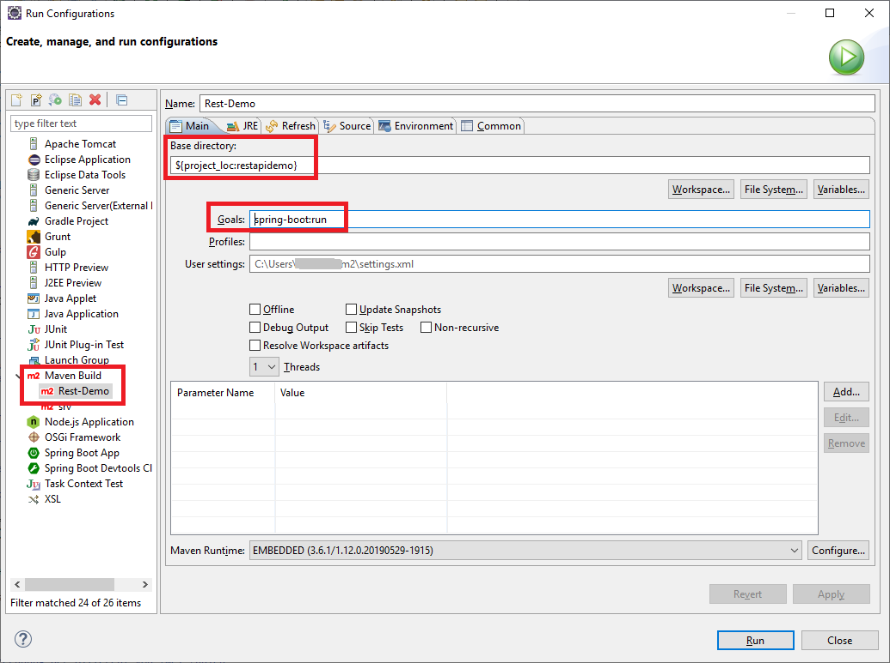

# Rest-API with Spring Boot

This repository contains a small [Spring Boot](https://spring.io/projects/spring-boot) application that shows how to implement a basic REST API.

 

----

# Running the application

To start the application (i.e. to start the web server) you have several options:

* On the command line (you need to have installed [Apache Maven](https://maven.apache.org/index.html)):

     * Run script `maven_run.bat` in Window's *cmd.exe* ("DOS Box").

     * Enter the following command:
       > mvn spring-boot:run

   

* In [Eclipse](https://www.eclipse.org/downloads/packages/) you can use a run configuration:

  

       

----

# JavaDoc

Execute script `maven_javadoc.bat` in Window's *cmd.exe*; the output files are written to folder `target/site/apidocs`.
	 
 

----
# License

See the [LICENSE file](LICENSE.md) for license rights and limitations (BSD 3-Clause License).	 